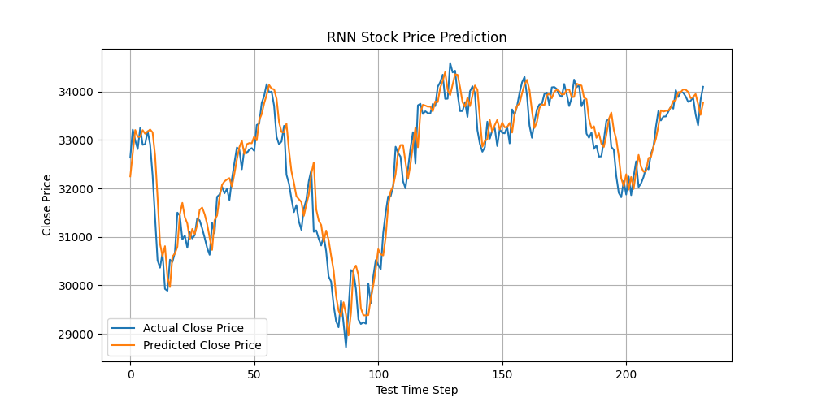
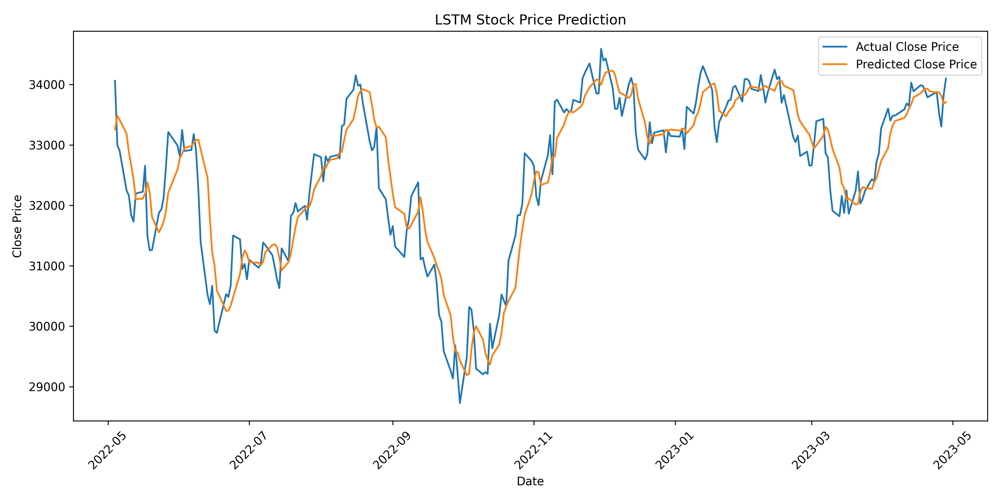

# Stock Price Prediction with From-Scratch RNN & LSTM

Next-day closing price prediction on Yahoo Finance data (2018–2023). We compare a **simple RNN implemented from scratch in NumPy** with an **LSTM whose gates are implemented by hand in PyTorch**. Neither model uses a built-in recurrent layer. This was a team project for CS 4375 Machine Learning at UT Dallas.

**Tech stack:** Python · NumPy · PyTorch · pandas · scikit-learn · Matplotlib

## Results

Both models use the previous 20 trading days to predict the next day's `Close*` price (80/20 train/test split, 1,258 trading days).

| Model | Implementation | Optimizer | Test RMSE | Test MAE | Test MSE |
|---|---|---|---|---|---|
| **Simple RNN** | NumPy, manual forward/backward pass | SGD | **393.61** | **303.20** | 154,929.82 |
| Manual LSTM | PyTorch tensor ops, hand-written gates | Adam | 502.64 | 394.51 | 252,649.45 |

The LSTM reached a test MAPE of **1.23%**.

<p align="center">
  
  
</p>

**Takeaway:** On this relatively small dataset, the simpler RNN outperformed the LSTM on MSE, RMSE, and MAE. The LSTM has more parameters and likely needs more data or more tuning to pull ahead.

## Models

### Simple RNN (NumPy)
- Forward pass, backpropagation through time, gradient clipping, and SGD parameter updates, all implemented by hand.
- Best configuration: sequence length 20, hidden size 32, learning rate 0.01, 50 epochs, MSE loss.

### Manual LSTM (PyTorch)
- Forget, input, and output gates, the candidate cell state, the cell state, and the hidden state are computed manually from basic tensor operations. The built-in `nn.LSTM` layer is not used.
- Best configuration: sequence length 20, hidden size 32, learning rate 0.01, 50 epochs, Adam, MSE loss (990 training and 248 test samples, final training loss 0.000687).

The experiment logs (`RNN/experiment_log.txt`, `LSTM/exp_log.txt`) record every hyperparameter setting and its MSE, RMSE, MAE, and MAPE.

## Dataset

[Yahoo Finance Dataset (2018–2023)](https://www.kaggle.com/datasets/suruchiarora/yahoo-finance-dataset-2018-2023) on Kaggle. The dataset has daily `Date`, `Open`, `High`, `Low`, `Close*`, `Adj Close**`, and `Volume` columns. The target is `Close*`.

The scripts download `stock_data.xlsx` at runtime from [this mirror](https://github.com/swevswev/cs4375_dataset), so no local copy is needed.

## Getting Started

```bash
pip install numpy pandas matplotlib scikit-learn openpyxl torch

# RNN: outputs training_loss.png and rnn_prediction_result.png
(cd RNN && python rnn_stock_prediction.py)

# LSTM: outputs lstm_training_loss.png and lstm_prediction_result.png
(cd LSTM && python lstm_stock_prediction.py)
```

## Project Structure

```text
.
├── RNN/
│   ├── rnn_stock_prediction.py
│   ├── experiment_log.txt
│   ├── training_loss.png
│   └── rnn_prediction_result.png
├── LSTM/
│   ├── lstm_stock_prediction.py
│   ├── exp_log.txt
│   ├── lstm_training_loss.png
│   └── lstm_prediction_result.png
└── Report/
    └── CS4375_Final_Report.pdf
```
